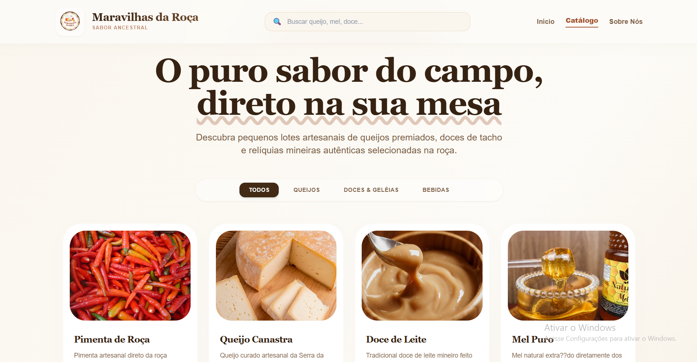
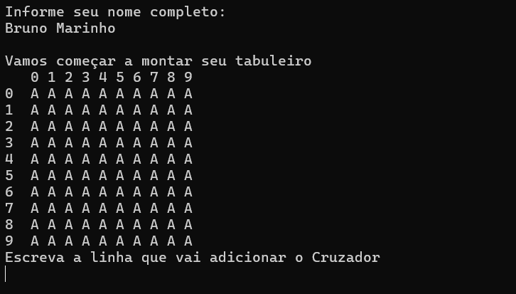
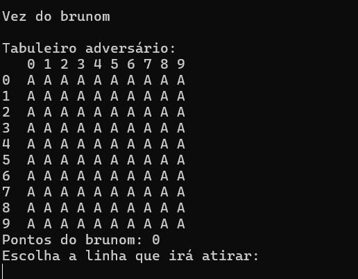

# Bruno Marinho

💻 Estudante de Sistemas de Informação

🎓 Desenvolvedor em formação, em transição para a área de tecnologia, com interesse em desenvolvimento de software, banco de dados e análise de dados. Busco criar soluções práticas e funcionais por meio de projetos acadêmicos e pessoais, aplicando conhecimentos de frontend, backend e modelagem de dados.

## 🛠️ Tecnologias

### Linguagens

* C#
* JavaScript
* HTML
* CSS
* SQL

### Banco de Dados

* SQL (MySQL e PostgreSQL)

### Frontend

* HTML
* CSS
* Vue.js
* Vite

### Backend

* Node.js
* Express.js
* .NET

### Dados / BI

* Power BI

### Ferramentas

* Git
* GitHub
* VS Code
* Power BI

---

## 🚀 Projetos

### 📍 Maravilhas da Roça

**Tecnologias:** TypeScript, Vue.js, Vite, Express.js e SQL

Aplicação web desenvolvida para praticar conceitos de desenvolvimento full stack. 

🌐 **Link para o site:**
https://maravilhas-da-roca-tiapn.vercel.app/

#### 📸 Interface da aplicação

---

### 📍 SmartTravel

🔗 **Repositório:** https://github.com/Brunodevit/SmartTravel

Projeto desenvolvido para auxiliar no planejamento de viagens, permitindo explorar destinos e organizar experiências personalizadas de acordo com os interesses do usuário.

#### 📸 Interface da aplicação

---

### 📍 CineTrack

🔗 **Repositório:** https://github.com/Brunodevit/CineTrack

Projeto desenvolvido no primeiro semestre do curso de Sistemas de Informação com foco na criação de um catálogo de filmes utilizando HTML, CSS, JavaScript e JSON Server.

#### 📸 Interface da aplicação

---

### 📍 Batalha Naval

🔗 **Repositório:** https://github.com/Brunodevit/BatalhaNaval

Projeto desenvolvido em C# como atividade acadêmica para praticar conceitos fundamentais de programação orientada a objetos e lógica de programação.

#### 📸 Interface da aplicação

---

## 🌍 Idiomas

* 🇧🇷 Português — Nativo
* 🇺🇸 Inglês — Avançado ([Certificação EF SET](https://cert.efset.org/pt/r1UVaV))
* 🇪🇸 Espanhol — Básico

---

## 🎯 Objetivo

Atuar como desenvolvedor full stack e contribuir para a construção de sistemas reais, ampliando minha experiência em desenvolvimento backend, APIs, banco de dados e arquitetura de software.

---

## 📫 Contato

* 📧 Email: [brunoms2083@gmail.com](mailto:brunoms2083@gmail.com)
* 💼 LinkedIn: https://www.linkedin.com/in/bruno-marinho-1052b62aa
